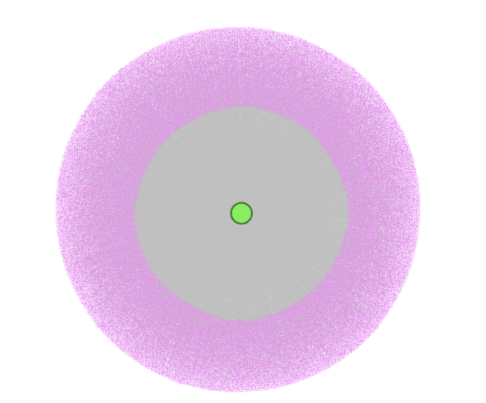
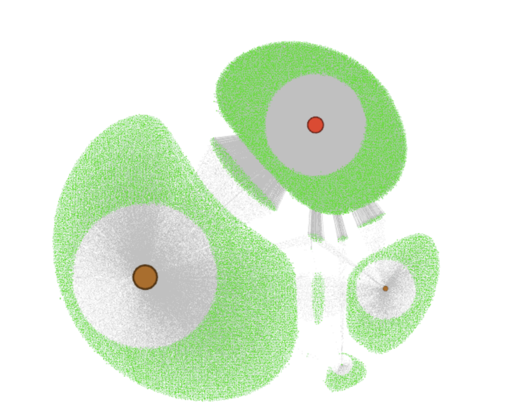
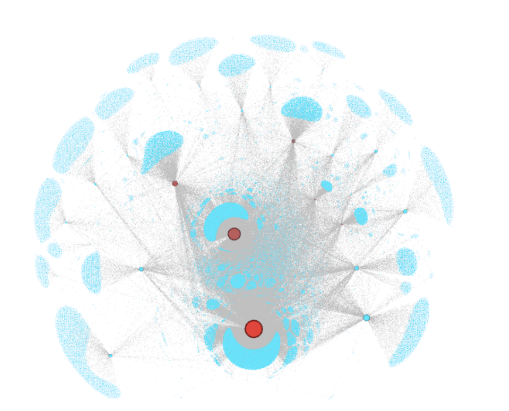

# Social Network Analysis of a Mobile Health Intervention on Twitter 

This project hosts some visualizations of an network analysis that I've done for a Univeristy project.

---

## 🎥 Network Visualization (Video)

Click the video below to watch a dynamic visualization of the full Twitter interaction network. Each node represents a Twitter account, and edges show interactions like retweets, likes, and quotes.

> 📽️ **Watch the animated network:** 

https://github.com/user-attachments/assets/dd13282e-54bd-43de-b890-649b87716e02

---

## 🖼️ Network Overview

Below is a still image of the **entire interaction network**, generated with Gephi:

---

## 🔍 Selected Communities

The network was analyzed to identify distinct **communities** using clustering algorithms. Here are visual excerpts of three major communities found in the data:

### 🟡 Community 1

### 🔵 Community 2

### 🟣 Community 3

